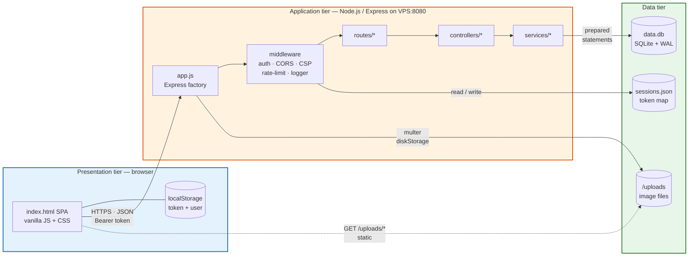
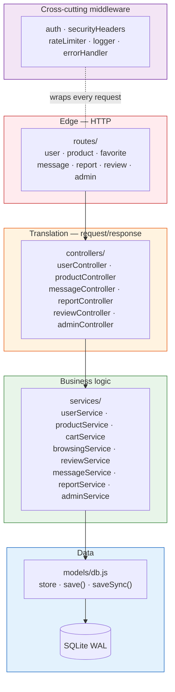
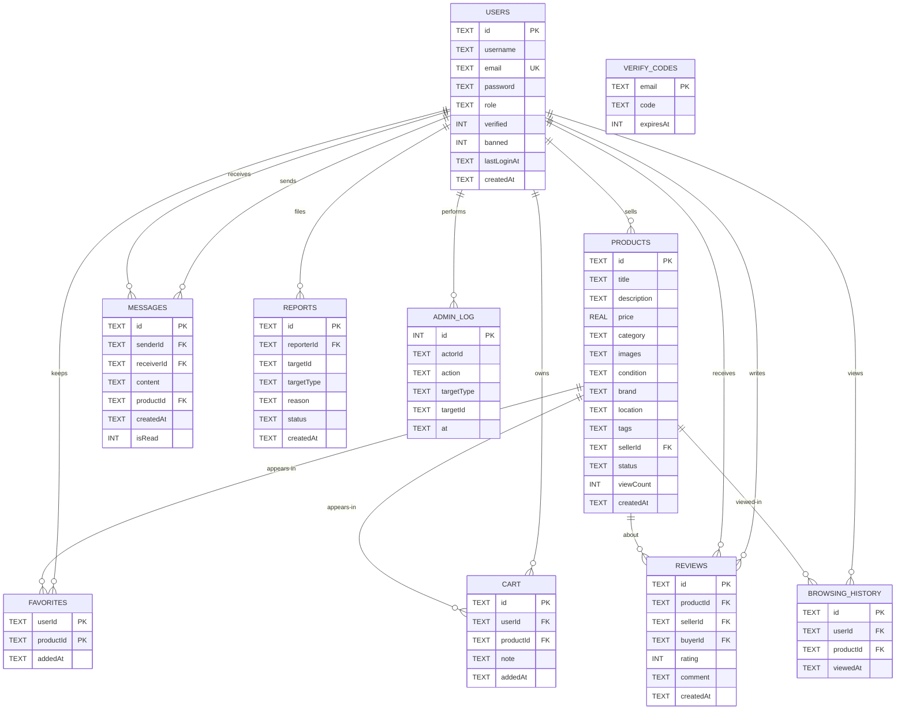
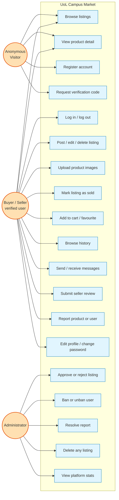
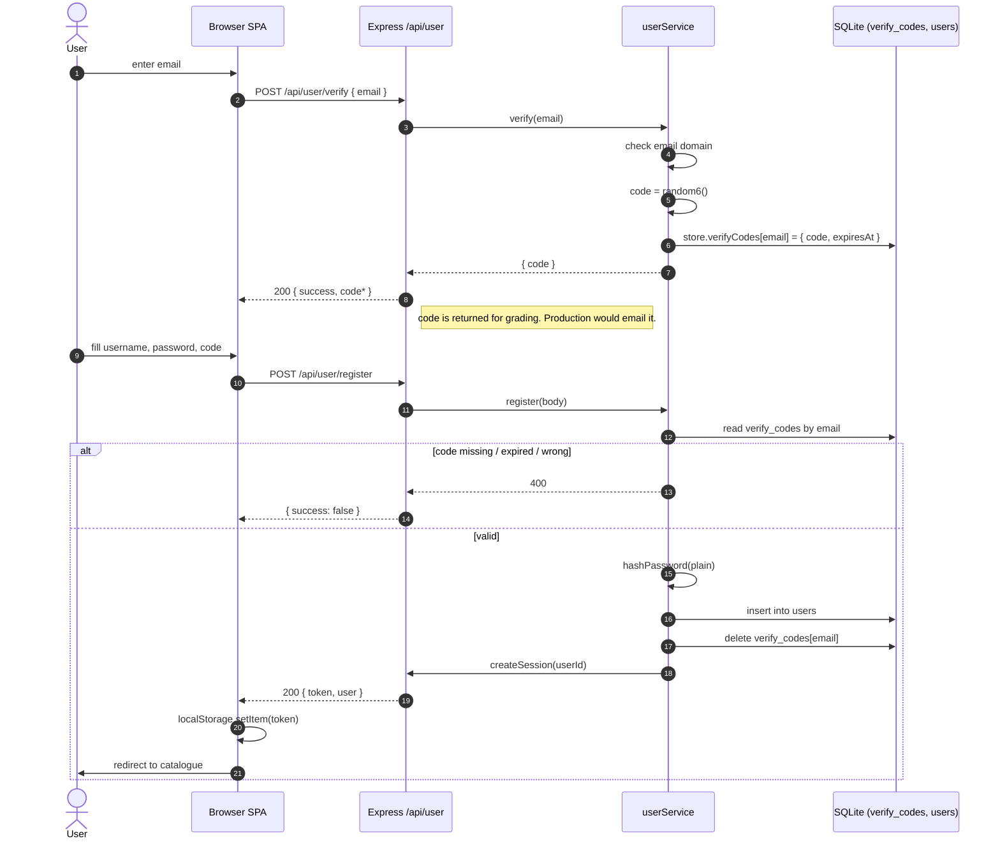
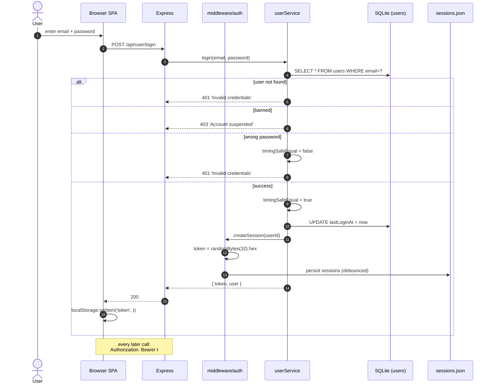
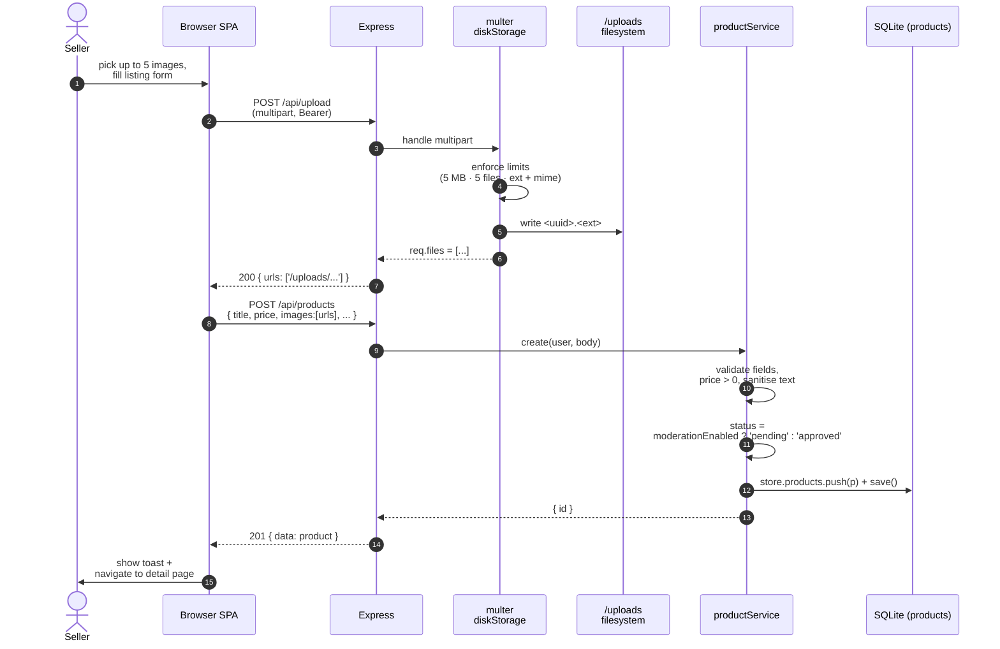
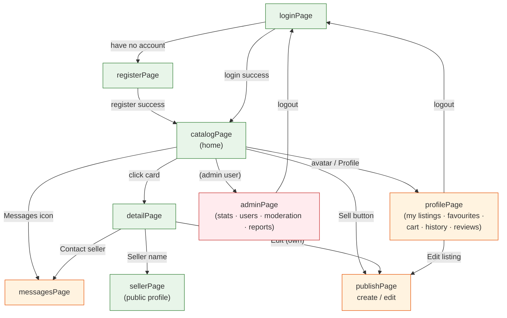
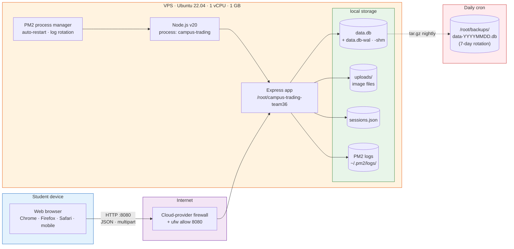

# Design Document — Diagram Source Code

All 9 figures referenced in `Design_Document.docx`, written in copy-paste-ready source.

| Figure | Format | Render at |
|--------|--------|-----------|
| F1, F2, F4, F5, F6, F7, F8, F9 | Mermaid | https://mermaid.live |
| F3 | dbdiagram.io DBML (preferred) **or** Mermaid erDiagram (fallback) | https://dbdiagram.io |

**Workflow:** open the link, paste the source, click **Export → PNG (2×)**, drag the PNG into the matching `[ Insert Image: … ]` box in the Word document.

> Tip: in mermaid.live, change the theme to **neutral** and the background to **white** before exporting — the default dark text on transparent background looks washed-out when printed.

---

## F1 — Figure 2.1: Three-tier architecture



---

## F2 — Figure 2.2: Layered module dependency



---

## F3 — Figure 3.1: Entity–Relationship diagram

### Option A (preferred) — dbdiagram.io DBML

Paste at <https://dbdiagram.io>:

```dbml
Table users {
  id varchar [pk]
  username varchar [not null]
  email varchar [unique, not null]
  password varchar [not null, note: 'PBKDF2 salt:hash']
  role varchar [not null, default: 'user']
  verified boolean [not null, default: false]
  banned boolean [not null, default: false]
  lastLoginAt varchar
  createdAt varchar [not null]

  Indexes {
    email [name: 'idx_users_email']
  }
}

Table products {
  id varchar [pk]
  title varchar [not null]
  description text
  price real [not null]
  category varchar
  images text [note: 'JSON array of /uploads paths']
  image varchar [note: 'first image, legacy']
  condition varchar [default: 'good']
  brand varchar
  purchaseDate varchar
  defects text
  location varchar
  tags text [note: 'JSON string array']
  sellerId varchar [not null, ref: > users.id]
  sellerName varchar
  status varchar [not null, default: 'pending', note: 'pending|approved|rejected|sold']
  viewCount integer [not null, default: 0]
  rejectReason text
  createdAt varchar [not null]
  updatedAt varchar

  Indexes {
    sellerId [name: 'idx_products_seller']
    status [name: 'idx_products_status']
    category [name: 'idx_products_category']
  }
}

Table messages {
  id varchar [pk]
  senderId varchar [not null, ref: > users.id]
  senderName varchar
  receiverId varchar [not null, ref: > users.id]
  receiverName varchar
  content text [not null]
  productId varchar [ref: > products.id]
  productTitle varchar
  createdAt varchar [not null]
  isRead boolean [not null, default: false]

  Indexes {
    senderId [name: 'idx_messages_sender']
    receiverId [name: 'idx_messages_receiver']
  }
}

Table reports {
  id varchar [pk]
  reporterId varchar [not null, ref: > users.id]
  reporterName varchar
  targetId varchar [not null]
  targetType varchar [not null, note: 'product|user']
  reason text
  status varchar [not null, default: 'pending']
  createdAt varchar [not null]
  handledAt varchar
  handledBy varchar
}

Table favorites {
  userId varchar [ref: > users.id]
  productId varchar [ref: > products.id]
  addedAt varchar [not null]

  Indexes {
    (userId, productId) [pk]
  }
}

Table cart {
  id varchar [pk]
  userId varchar [not null, ref: > users.id]
  productId varchar [not null, ref: > products.id]
  note text
  addedAt varchar [not null]

  Indexes {
    (userId, productId) [unique]
    userId [name: 'idx_cart_user']
  }
}

Table reviews {
  id varchar [pk]
  productId varchar [not null, ref: > products.id]
  sellerId varchar [not null, ref: > users.id]
  buyerId varchar [not null, ref: > users.id]
  buyerName varchar
  rating integer [not null, note: '1..5']
  comment text
  createdAt varchar [not null]

  Indexes {
    sellerId [name: 'idx_reviews_seller']
    productId [name: 'idx_reviews_product']
  }
}

Table browsing_history {
  id varchar [pk]
  userId varchar [not null, ref: > users.id]
  productId varchar [not null, ref: > products.id]
  viewedAt varchar [not null]

  Indexes {
    userId [name: 'idx_history_user']
  }
}

Table verify_codes {
  email varchar [pk]
  code varchar [not null]
  expiresAt integer [not null, note: 'unix-ms, +10min']
}

Table admin_log {
  id integer [pk, increment]
  actorId varchar
  actorName varchar
  action varchar
  targetType varchar
  targetId varchar
  detail text
  at varchar [not null]
}
```

### Option B (fallback) — Mermaid erDiagram



---

## F4 — Figure 4.1: Use-case diagram



---

## F5 — Figure 4.2: Registration sequence



---

## F6 — Figure 4.3: Login sequence



---

## F7 — Figure 4.4: Publish a listing with image upload



---

## F8 — Figure 5.1: Front-end page navigation



---

## F9 — Figure 8.1: Deployment diagram



---

## Quick rendering checklist

1. Open <https://mermaid.live> (or <https://dbdiagram.io> for F3 option A).
2. For each diagram above: copy the fenced block (only the lines between the triple backticks, **not** the backticks themselves), paste into the editor.
3. Wait for the preview to render. If it errors, check that you didn't accidentally include the leading ` ```mermaid ` line.
4. Export → **PNG** (set scale to 2× for sharper print).
5. Open `Design_Document.docx`, scroll to the matching **[ Insert Image: Figure x.y … ]** placeholder, click on the dashed yellow box to select the table cell, **Delete** it, then **Insert → Pictures** → choose the PNG you just exported.
6. Add a caption underneath the image: *Insert → Caption → Label "Figure", number "x.y"*.
